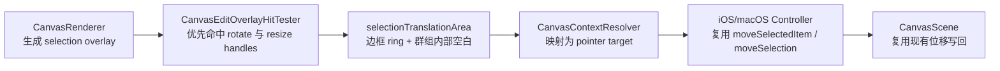

# 方案 2 分阶段计划

## 目标

在不改动现有位移写回链路的前提下，为选区补一条与 `cropTranslationArea` 对称的 `selectionTranslationArea` 交互通道。

落地口径按当前架构收敛为两条规则：

- 单选：新增“边框 ring 可拖动移动”，但不吞掉正文 `selectedItemBody`，保留单击文字进入编辑。
- 多选：新增“边框 ring + 群组选框内部空白可拖动移动”；这里的“内部空白”定义为选区 `activeScreenQuad` 内、但不落在任何已选成员 `screenQuad` 内的区域。

这样既满足方案 2 的体验目标，又不会把单选正文点击语义打碎。

## 目标链路

## 关键设计决策

- 在 [MyCanvas_Ver_0/Canvas/Core/CanvasPointerPressContext.swift](MyCanvas_Ver_0/Canvas/Core/CanvasPointerPressContext.swift) 和 [MyCanvas_Ver_0/Canvas/Core/CanvasEditOverlayHitTester.swift](MyCanvas_Ver_0/Canvas/Core/CanvasEditOverlayHitTester.swift) 新增单一 `selectionTranslationArea` 枚举，不再额外拆分 `groupSelectionTranslationArea`。单选/多选仍由控制器现有 `selectionCount` 分支决定走 `moveSelectedItem` 还是 `moveSelection`。
- 在 [MyCanvas_Ver_0/Canvas/Core/CanvasContextResolver.swift](MyCanvas_Ver_0/Canvas/Core/CanvasContextResolver.swift) 为选区新增专用 `selectionOutlineHitTargetWidth`，不要复用 `cropOutlineHitTargetWidth`，避免 crop/selection 两套语义耦合。
- `selectionTranslationArea` 的命中优先级放在 `rotateHandle` / `selectionHandle` 之后、正文 `selectedItemBody` 之前，确保角点缩放和旋转仍然优先。
- 上下文菜单层继续折叠到现有 `selectedItemBody` 语义，尽量不改 [MyCanvas_Ver_0/Platform/Shared/ContextMenu/CanvasContextMenuCommandResolver.swift](MyCanvas_Ver_0/Platform/Shared/ContextMenu/CanvasContextMenuCommandResolver.swift) 的动作分类。
- `CanvasScene`、[MyCanvas_Ver_0/Canvas/Editing/CanvasSelectedItemDragState.swift](MyCanvas_Ver_0/Canvas/Editing/CanvasSelectedItemDragState.swift)、[MyCanvas_Ver_0/Canvas/Editing/CanvasSelectionTransformState.swift](MyCanvas_Ver_0/Canvas/Editing/CanvasSelectionTransformState.swift) 这层几何写回不需要改；本次只补“命中与分发缺口”。

## Phase 1：补齐交互契约与度量

- 在 [MyCanvas_Ver_0/Canvas/Core/CanvasEditOverlayHitTester.swift](MyCanvas_Ver_0/Canvas/Core/CanvasEditOverlayHitTester.swift) 的 `CanvasEditOverlayHitTargetKind` 增加 `selectionTranslationArea`。
- 在 [MyCanvas_Ver_0/Canvas/Core/CanvasPointerPressContext.swift](MyCanvas_Ver_0/Canvas/Core/CanvasPointerPressContext.swift) 的 `CanvasPointerTargetKind` 增加 `selectionTranslationArea`，并补 `debugName`。
- 在 [MyCanvas_Ver_0/Canvas/Core/CanvasContextResolver.swift](MyCanvas_Ver_0/Canvas/Core/CanvasContextResolver.swift) 的 `CanvasContextResolverMetrics` 增加 `selectionOutlineHitTargetWidth`。
- 在 [MyCanvas_Ver_0/Platform/iOS/iOSViewController.swift](MyCanvas_Ver_0/Platform/iOS/iOSViewController.swift) 和 [MyCanvas_Ver_0/Platform/macOS/macOSViewController.swift](MyCanvas_Ver_0/Platform/macOS/macOSViewController.swift) 的 `contextResolverMetrics` 构造处接入新字段。
- 这一阶段只建立“语言层契约”，不改移动逻辑。

## Phase 2：实现选区 translation area 的几何命中

- 在 [MyCanvas_Ver_0/Canvas/Core/CanvasEditOverlayHitTester.swift](MyCanvas_Ver_0/Canvas/Core/CanvasEditOverlayHitTester.swift) 扩展 `resolveSelectionHitTarget(...)`，顺序保持为：
  1. `rotateHandle`
  2. `selectionHandle` / `groupSelectionHandle`
  3. `selectionTranslationArea`
  4. 回退到正文 / blank
- 将 `selectionTranslationArea` 拆成两块命中区域：
  - `selectionOutlineArea`：围绕 `editOverlay.activeScreenQuad` 的 ring 命中，宽度由 `selectionOutlineHitTargetWidth` 控制。
  - `selectionInteriorBlankArea`：点在 `editOverlay.activeScreenQuad` 内，但不在任何已选成员 `screenQuad` 内。
- 已选成员集合直接利用 `payload.subject.memberItemIDs` 和 `renderSnapshot.items` 过滤得到，优先不改 [MyCanvas_Ver_0/Canvas/Core/CanvasRenderer.swift](MyCanvas_Ver_0/Canvas/Core/CanvasRenderer.swift) / `CanvasEditSelectionOverlayPayload`。
- 如有必要，可把 crop 现有 `isWithinCropTranslationArea(...)` 抽成通用 quad 边缘命中 helper，但不要在本阶段顺手重构其它 overlay。

## Phase 3：把新 target 接入现有分发链路

- 在 [MyCanvas_Ver_0/Canvas/Core/CanvasContextResolver.swift](MyCanvas_Ver_0/Canvas/Core/CanvasContextResolver.swift)：
  - `contextResolverBranch(for:)` 增加 `selectionTranslationArea` 分支，日志上能区分命中来源。
  - `resolvedTarget(from:)` 把新 hit target 映射成新 pointer target。
  - `contextMenuTargetKind(for:)` 将 `selectionTranslationArea` 折叠为 `.selectedItemBody`，避免菜单动作矩阵膨胀。
- 在 [MyCanvas_Ver_0/Canvas/Input/CanvasClickSelectionResolver.swift](MyCanvas_Ver_0/Canvas/Input/CanvasClickSelectionResolver.swift)：
  - 为 `selectionTranslationArea` 增加显式分支，点击不改 selection、不触发文字编辑，返回 `.none`。
  - 保持 `selectedItemBody` 的单选文字点击编辑语义不变。
- 在 [MyCanvas_Ver_0/Platform/iOS/iOSViewController.swift](MyCanvas_Ver_0/Platform/iOS/iOSViewController.swift) 和 [MyCanvas_Ver_0/Platform/macOS/macOSViewController.swift](MyCanvas_Ver_0/Platform/macOS/macOSViewController.swift)：
  - `handlePrimaryPointerMove(...)` 为 `selectionTranslationArea` 复用 `.selectedItemBody` 的 move 分支。
  - `beginPointerHistoryTransactionIfNeeded(...)`、日志 reason、pointer-up 提交 reason 同步纳入 `move item` / `move selection` 语义。
- 本阶段不触碰 `CanvasScene`，继续复用现有 `moveSelectedItem(...)` / `moveSelection(...)` 和 history 提交流程。

## Phase 4：补齐测试，先守住语义再放开交互

- 在 [MyCanvas_Ver_0Tests/CanvasEditorSessionAlignmentOverlayTests.swift](MyCanvas_Ver_0Tests/CanvasEditorSessionAlignmentOverlayTests.swift) 新增集成级命中测试：
  - 单选：点击边框 ring 命中 `selectionTranslationArea`。
  - 单选：点击正文仍命中 `selectedItemBody`。
  - 多选：点击群组选框内部空白命中 `selectionTranslationArea`。
  - 多选：点击成员正文仍命中 `selectedItemBody`。
  - 优先级：rotate/resize handle 命中要继续盖过 translation area。
- 在 [MyCanvas_Ver_0Tests/CanvasClickSelectionResolverTests.swift](MyCanvas_Ver_0Tests/CanvasClickSelectionResolverTests.swift) 增加逻辑测试：
  - `selectionTranslationArea` 点击返回 `.none`。
  - 现有 `selectedItemBody + singleSelectedItemID -> attemptTextEdit` 保持不变。
- 如命中几何开始变复杂，再单独补一个 `CanvasEditOverlayHitTesterTests`，把 ring/slop/旋转 quad 边界条件从会话测试中拆出来；否则先复用会话级测试，避免测试层过早分散。
- 视需要补一条 [MyCanvas_Ver_0Tests/CanvasContextMenuActionResolverTests.swift](MyCanvas_Ver_0Tests/CanvasContextMenuActionResolverTests.swift) 回归测试，确认 `selectionTranslationArea` 经 `ContextResolver` 折叠后仍拿到现有 `selectedItemBody` 菜单动作。

## Phase 5：双平台人工验证与收尾

- iOS / macOS 都验证以下场景：
  - 单选文字：拖边框可以移动；点正文仍进入编辑；拖角点仍缩放。
  - 单选图片：拖边框移动；正文拖动仍移动；空白处仍拖动画布。
  - 多选：拖群组选框边框和成员之间空白都能整体移动。
  - 旋转手柄、角点缩放、crop 模式、阅读模式不回归。
- 若验证发现“群组内部空白”命中与成员 `screenQuad` 交界抖动，再回到 Phase 2 调整 slop/优先级，不在控制器层打补丁。

## 风险与控制点

- 最大风险不是 move 本身，而是误吞掉 `selectedItemBody`，导致单选文字失去点击编辑；因此 Phase 2 和 Phase 4 要把“正文 carve-out”作为第一优先级。
- 第二风险是复用 crop 指标/逻辑后语义串味，所以选区要有自己的 `selectionOutlineHitTargetWidth`。
- 第三风险是把多选包围盒内部全部当成 translation area 时，成员之间空白也会变成可拖区；这是本方案的刻意行为，不是 bug，需要在手测中明确验证。

## 预期影响面

- 直接改动：
  - [MyCanvas_Ver_0/Canvas/Core/CanvasEditOverlayHitTester.swift](MyCanvas_Ver_0/Canvas/Core/CanvasEditOverlayHitTester.swift)
  - [MyCanvas_Ver_0/Canvas/Core/CanvasPointerPressContext.swift](MyCanvas_Ver_0/Canvas/Core/CanvasPointerPressContext.swift)
  - [MyCanvas_Ver_0/Canvas/Core/CanvasContextResolver.swift](MyCanvas_Ver_0/Canvas/Core/CanvasContextResolver.swift)
  - [MyCanvas_Ver_0/Canvas/Input/CanvasClickSelectionResolver.swift](MyCanvas_Ver_0/Canvas/Input/CanvasClickSelectionResolver.swift)
  - [MyCanvas_Ver_0/Platform/iOS/iOSViewController.swift](MyCanvas_Ver_0/Platform/iOS/iOSViewController.swift)
  - [MyCanvas_Ver_0/Platform/macOS/macOSViewController.swift](MyCanvas_Ver_0/Platform/macOS/macOSViewController.swift)
  - [MyCanvas_Ver_0Tests/CanvasEditorSessionAlignmentOverlayTests.swift](MyCanvas_Ver_0Tests/CanvasEditorSessionAlignmentOverlayTests.swift)
  - [MyCanvas_Ver_0Tests/CanvasClickSelectionResolverTests.swift](MyCanvas_Ver_0Tests/CanvasClickSelectionResolverTests.swift)
- 原则上不改：
  - [MyCanvas_Ver_0/Canvas/Core/CanvasRenderer.swift](MyCanvas_Ver_0/Canvas/Core/CanvasRenderer.swift)
  - [MyCanvas_Ver_0/Canvas/Core/CanvasScene.swift](MyCanvas_Ver_0/Canvas/Core/CanvasScene.swift)
  - [MyCanvas_Ver_0/Canvas/Editing/CanvasSelectedItemDragState.swift](MyCanvas_Ver_0/Canvas/Editing/CanvasSelectedItemDragState.swift)
  - [MyCanvas_Ver_0/Canvas/Editing/CanvasSelectionTransformState.swift](MyCanvas_Ver_0/Canvas/Editing/CanvasSelectionTransformState.swift)

