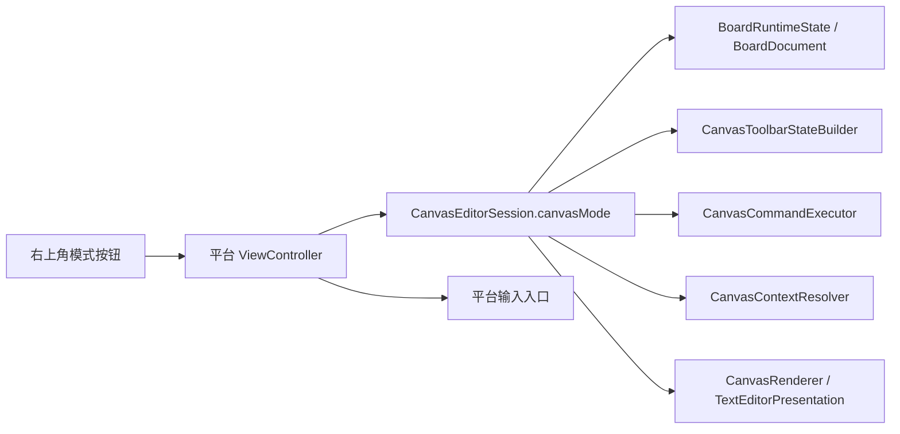

# 阅读模式切换计划

## 目标与约束

- 目标：在画板右上角新增一个悬浮模式按钮，用符号而不是文字，在“编辑模式”和“阅读模式”之间切换。
- 模式语义：
  - 编辑模式：保持当前行为，允许现有全部画板操作。
  - 阅读模式：只允许缩放、平移和必要导航；编辑向 chrome 隐藏；不允许创建、修改、删除、选择、裁剪、文本编辑、导入、上下文菜单等编辑行为。
- 你已确认的约束：
  - 模式按画板持久化，而不是仅当前会话有效。
  - 切到阅读模式时保留当前状态，不主动清空选中项，也不主动结束内联裁剪/文本编辑；因此实现上必须区分“状态保留”和“呈现冻结”。

## 关键现状

- 工具条显隐当前已经有天然挂点：`[MyCanvas_Ver_0/Platform/Shared/Toolbar/CanvasToolbarStateBuilder.swift](/Users/shaun/Library/Mobile Documents/com~apple~CloudDocs/Develop/MyCanvas_Ver_0/MyCanvas_Ver_0/Platform/Shared/Toolbar/CanvasToolbarStateBuilder.swift)` 统一生成 `CanvasToolbarState`，而 `toolbar host` 在 `render` 中会因为 `items.isEmpty` 自动隐藏。
- 右上角悬浮控件最自然的承载层是 `[MyCanvas_Ver_0/Platform/iOS/iOSViewController.swift](/Users/shaun/Library/Mobile Documents/com~apple~CloudDocs/Develop/MyCanvas_Ver_0/MyCanvas_Ver_0/Platform/iOS/iOSViewController.swift)` / `[MyCanvas_Ver_0/Platform/macOS/macOSViewController.swift](/Users/shaun/Library/Mobile Documents/com~apple~CloudDocs/Develop/MyCanvas_Ver_0/MyCanvas_Ver_0/Platform/macOS/macOSViewController.swift)` 中的 `chromeOverlayView`，并应进入 `baseChromeBlockersForToolbarLayout()` 参与 toolbar / minimap / context menu 避让。
- 当前持久化链路已经覆盖相机和选中项：`[MyCanvas_Ver_0/Canvas/Storage/BoardDocument.swift](/Users/shaun/Library/Mobile Documents/com~apple~CloudDocs/Develop/MyCanvas_Ver_0/MyCanvas_Ver_0/Canvas/Storage/BoardDocument.swift)` 的 `BoardRuntimeState` / `BoardDocument`，以及 `[MyCanvas_Ver_0/Canvas/Storage/BoardDocumentMapper.swift](/Users/shaun/Library/Mobile Documents/com~apple~CloudDocs/Develop/MyCanvas_Ver_0/MyCanvas_Ver_0/Canvas/Storage/BoardDocumentMapper.swift)`。
- 当前渲染与编辑浮层直接吃 `interactionState` / `inlineEditState`：`[MyCanvas_Ver_0/Canvas/Core/CanvasRenderer.swift](/Users/shaun/Library/Mobile Documents/com~apple~CloudDocs/Develop/MyCanvas_Ver_0/MyCanvas_Ver_0/Canvas/Core/CanvasRenderer.swift)` 会根据它们绘制选中框与裁剪框；`[MyCanvas_Ver_0/Platform/iOS/iOSViewController.swift](/Users/shaun/Library/Mobile Documents/com~apple~CloudDocs/Develop/MyCanvas_Ver_0/MyCanvas_Ver_0/Platform/iOS/iOSViewController.swift)` 和 `[MyCanvas_Ver_0/Platform/macOS/macOSViewController.swift](/Users/shaun/Library/Mobile Documents/com~apple~CloudDocs/Develop/MyCanvas_Ver_0/MyCanvas_Ver_0/Platform/macOS/macOSViewController.swift)` 的 `syncTextEditorPresentation()` 会直接根据 `inlineEditState.mode == .text` 显示文本编辑浮层。

## Phase 1：建立共享模式契约与按画板持久化

- 新增共享模式类型，建议命名为 `CanvasWorkspaceMode` 或 `CanvasInteractionMode`，放在共享层，包含 `.editing` 与 `.reading`，并提供：
  - `systemImageName`：用于右上角按钮显示“当前模式”符号。
  - `accessibilityLabel` / `accessibilityValue`：便于后续双端按钮直接消费。
- 在 `[MyCanvas_Ver_0/Canvas/Editing/CanvasEditorSession.swift](/Users/shaun/Library/Mobile Documents/com~apple~CloudDocs/Develop/MyCanvas_Ver_0/MyCanvas_Ver_0/Canvas/Editing/CanvasEditorSession.swift)` 中加入模式状态，例如 `canvasMode`，作为全局单一真源。
- 将模式纳入持久化链：
  - `[MyCanvas_Ver_0/Canvas/Storage/BoardDocument.swift](/Users/shaun/Library/Mobile Documents/com~apple~CloudDocs/Develop/MyCanvas_Ver_0/MyCanvas_Ver_0/Canvas/Storage/BoardDocument.swift)`
  - `[MyCanvas_Ver_0/Canvas/Storage/BoardDocumentMapper.swift](/Users/shaun/Library/Mobile Documents/com~apple~CloudDocs/Develop/MyCanvas_Ver_0/MyCanvas_Ver_0/Canvas/Storage/BoardDocumentMapper.swift)`
  - `[MyCanvas_Ver_0/Canvas/Editing/CanvasEditorSession.swift](/Users/shaun/Library/Mobile Documents/com~apple~CloudDocs/Develop/MyCanvas_Ver_0/MyCanvas_Ver_0/Canvas/Editing/CanvasEditorSession.swift)` 的 `applyBoardRuntimeState(...)` / `currentBoardRuntimeState()` 链路
- 兼容策略：旧文档没有该字段时默认回落到 `.editing`，避免破坏现有板子读取。
- 这一阶段不处理 UI，只把模式定义和每个 board 的状态闭环建立好。

## Phase 2：接入右上角悬浮模式按钮与 chrome 避让

- 在 `[MyCanvas_Ver_0/Platform/iOS/iOSViewController.swift](/Users/shaun/Library/Mobile Documents/com~apple~CloudDocs/Develop/MyCanvas_Ver_0/MyCanvas_Ver_0/Platform/iOS/iOSViewController.swift)` 与 `[MyCanvas_Ver_0/Platform/macOS/macOSViewController.swift](/Users/shaun/Library/Mobile Documents/com~apple~CloudDocs/Develop/MyCanvas_Ver_0/MyCanvas_Ver_0/Platform/macOS/macOSViewController.swift)` 中新增右上角悬浮按钮，作为 `chromeOverlayView` 子视图，与 `backButton` 同级。
- 用 `safeAreaLayoutGuide` / `safeAreaInsets` 把它锚定在右上角，与左上角返回键形成对称布局。
- 模式按钮图标显示当前模式，而不是目标模式：
  - 编辑模式显示编辑符号，例如 `pencil`
  - 阅读模式显示阅读符号，例如 `book.closed`
- 将该按钮接入 `chrome` 占位链：
  - 在 `[MyCanvas_Ver_0/Platform/iOS/iOSViewController.swift](/Users/shaun/Library/Mobile Documents/com~apple~CloudDocs/Develop/MyCanvas_Ver_0/MyCanvas_Ver_0/Platform/iOS/iOSViewController.swift)` / `[MyCanvas_Ver_0/Platform/macOS/macOSViewController.swift](/Users/shaun/Library/Mobile Documents/com~apple~CloudDocs/Develop/MyCanvas_Ver_0/MyCanvas_Ver_0/Platform/macOS/macOSViewController.swift)` 的 `baseChromeBlockersForToolbarLayout()` 中加入该按钮。
  - 如有必要，为 `[MyCanvas_Ver_0/Platform/Shared/CanvasChromeLayoutContext.swift](/Users/shaun/Library/Mobile Documents/com~apple~CloudDocs/Develop/MyCanvas_Ver_0/MyCanvas_Ver_0/Platform/Shared/CanvasChromeLayoutContext.swift)` 新增新的 `CanvasChromeBlockerKind`，例如 `modeToggle`，让 blocker 语义更清晰。
- 目标结果：工具条、小地图、上下文菜单都会自动避让右上角模式按钮，而不是靠手工偏移硬顶。

## Phase 3：在“保留当前状态”的前提下冻结编辑呈现

- 这是本需求里最关键、也最容易被漏掉的一层。
- 因为你要求“切到阅读模式时保留当前状态”，所以不能简单地清掉：
  - `interactionState.selectedItemID`
  - `inlineEditState`
  - `rotationPreviewState` / 其他交互态
- 但当前渲染链会直接把这些状态画出来，因此需要增加“呈现门控”，把“真实状态”和“当前允许展示的状态”分开。
- 建议在 `[MyCanvas_Ver_0/Canvas/Editing/CanvasEditorSession.swift](/Users/shaun/Library/Mobile Documents/com~apple~CloudDocs/Develop/MyCanvas_Ver_0/MyCanvas_Ver_0/Canvas/Editing/CanvasEditorSession.swift)` 内引入只读的 presentation 视角，例如：
  - `presentationInteractionState`
  - `presentationInlineEditState`
  - 或同等语义的 helper
- 在阅读模式下：
  - `CanvasRenderer` 不再拿到真实的选中/裁剪状态，从而隐藏选中框、裁剪框、旋转 affordance。
  - `syncTextEditorPresentation()` 无论真实 `inlineEditState` 是否是 `.text`，都强制隐藏文本编辑浮层；返回编辑模式后再恢复。
- 接入点：
  - `[MyCanvas_Ver_0/Canvas/Core/CanvasRenderer.swift](/Users/shaun/Library/Mobile Documents/com~apple~CloudDocs/Develop/MyCanvas_Ver_0/MyCanvas_Ver_0/Canvas/Core/CanvasRenderer.swift)`
  - `[MyCanvas_Ver_0/Canvas/Editing/CanvasEditorSession.swift](/Users/shaun/Library/Mobile Documents/com~apple~CloudDocs/Develop/MyCanvas_Ver_0/MyCanvas_Ver_0/Canvas/Editing/CanvasEditorSession.swift)` 的 `makeCanvasSnapshot()` / `makeMiniMapSnapshot()`
  - `[MyCanvas_Ver_0/Platform/iOS/iOSViewController.swift](/Users/shaun/Library/Mobile Documents/com~apple~CloudDocs/Develop/MyCanvas_Ver_0/MyCanvas_Ver_0/Platform/iOS/iOSViewController.swift)` / `[MyCanvas_Ver_0/Platform/macOS/macOSViewController.swift](/Users/shaun/Library/Mobile Documents/com~apple~CloudDocs/Develop/MyCanvas_Ver_0/MyCanvas_Ver_0/Platform/macOS/macOSViewController.swift)` 的 `syncTextEditorPresentation()`
- 同阶段处理编辑向 chrome：
  - `[MyCanvas_Ver_0/Platform/Shared/Toolbar/CanvasToolbarStateBuilder.swift](/Users/shaun/Library/Mobile Documents/com~apple~CloudDocs/Develop/MyCanvas_Ver_0/MyCanvas_Ver_0/Platform/Shared/Toolbar/CanvasToolbarStateBuilder.swift)` 在阅读模式下直接返回空 `items`，复用现有 `toolbar host` 的自动隐藏行为。
  - `iOS` 的 `historyButtonsStackView` 在阅读模式下隐藏；`macOS` 当前没有等价浮动 history chrome，无需新增处理。

## Phase 4：统一门控命令、工具条和上下文菜单

- 阅读模式不能只靠 UI 隐藏，还要从共享命令语义层做统一门控。
- 在 `[MyCanvas_Ver_0/Canvas/Editing/CanvasCommandExecutor.swift](/Users/shaun/Library/Mobile Documents/com~apple~CloudDocs/Develop/MyCanvas_Ver_0/MyCanvas_Ver_0/Canvas/Editing/CanvasCommandExecutor.swift)` 中增加基于 `canvasMode` 的命令门控：
  - 禁止新增文字、开始文字编辑、提交文字编辑、进入裁剪、导入、删除、复制、层级调整、选择与清选等编辑向命令。
  - 保留与阅读模式兼容的导航类能力；如果当前没有对应 `CanvasCommand`，则保持为控制器级输入。
- 在 `[MyCanvas_Ver_0/Platform/Shared/ContextMenu/CanvasContextMenuCommandResolver.swift](/Users/shaun/Library/Mobile Documents/com~apple~CloudDocs/Develop/MyCanvas_Ver_0/MyCanvas_Ver_0/Platform/Shared/ContextMenu/CanvasContextMenuCommandResolver.swift)` 中对阅读模式做统一处理：
  - 最严格方案：阅读模式返回空菜单。
  - 如果后续产品希望保留只读菜单，再在此基础上加白名单，而不是反过来从全量菜单里删。
- 在 `[MyCanvas_Ver_0/Platform/Shared/Toolbar/CanvasToolbarStateBuilder.swift](/Users/shaun/Library/Mobile Documents/com~apple~CloudDocs/Develop/MyCanvas_Ver_0/MyCanvas_Ver_0/Platform/Shared/Toolbar/CanvasToolbarStateBuilder.swift)` 中，工具条的隐藏与命令门控保持一致，避免出现“按钮隐藏了但命令仍可执行”或反之。

## Phase 5：输入链收敛为“阅读模式只允许平移/缩放/导航”

- 仅靠命令门控还不够，因为当前有大量输入入口不经过 `CanvasCommandExecutor`。
- 这一阶段需要把输入层也统一到阅读模式语义上，分成两类处理：

### 5.1 Resolver 与画布命中降级

- 在 `[MyCanvas_Ver_0/Canvas/Editing/CanvasEditorSession.swift](/Users/shaun/Library/Mobile Documents/com~apple~CloudDocs/Develop/MyCanvas_Ver_0/MyCanvas_Ver_0/Canvas/Editing/CanvasEditorSession.swift)` 的 `resolvePointerTarget()` / `resolveContext()` 把 `canvasMode` 透传给 `[MyCanvas_Ver_0/Canvas/Core/CanvasContextResolver.swift](/Users/shaun/Library/Mobile Documents/com~apple~CloudDocs/Develop/MyCanvas_Ver_0/MyCanvas_Ver_0/Canvas/Core/CanvasContextResolver.swift)`。
- 在阅读模式下，把命中降级为“画布导航语义”，而不是 item body / handle / crop target / text target。
- 这样现有双端大块 pointer 状态机会自然更偏向走 `draggingCanvas`，减少在控制器里做大量条件分叉。

### 5.2 平台系统输入早退

- 在 `[MyCanvas_Ver_0/Platform/iOS/iOSViewController.swift](/Users/shaun/Library/Mobile Documents/com~apple~CloudDocs/Develop/MyCanvas_Ver_0/MyCanvas_Ver_0/Platform/iOS/iOSViewController.swift)` / `[MyCanvas_Ver_0/Platform/macOS/macOSViewController.swift](/Users/shaun/Library/Mobile Documents/com~apple~CloudDocs/Develop/MyCanvas_Ver_0/MyCanvas_Ver_0/Platform/macOS/macOSViewController.swift)` 中，对下列不走 command 的系统入口做早退门控：
  - `handleLongPress()` / `handleSecondaryClick()`：阅读模式不弹上下文菜单
  - `onImportDrop` / 导入入口 / `handlePasteRequest()`：阅读模式禁止导入与粘贴
  - 任何直接启动编辑的手势入口：阅读模式禁止进入
- 保留项：
  - `onPan` / `handleIndirectPan` 等平移路径
  - `onZoom` / `handleZoom`
  - 小地图导航 `handleMiniMapNavigate()`，因为它本质上仍是移动画布视角
  - 返回按钮

## Phase 6：验证、兼容与回归

- 持久化兼容：旧文档没有模式字段时应自动落回 `.editing`；新字段不应破坏现有 board 读取。
- 手工验证场景至少覆盖：
  - 初始进入画板默认编辑模式
  - 点击右上角按钮切到阅读模式后，工具条隐藏、iOS 历史按钮隐藏、只剩平移/缩放/小地图导航
  - 编辑模式下选中图片，再切阅读模式：选中状态在内存中保留，但选中框不再显示；切回编辑模式后恢复
  - 编辑模式下进入裁剪，再切阅读模式：裁剪状态不丢，但裁剪框/手柄不再显示；切回编辑模式后恢复
  - 编辑模式下进入文字编辑，再切阅读模式：文本编辑浮层隐藏、不能继续输入；切回编辑模式后恢复 draft
  - 阅读模式下长按/副键菜单、导入、粘贴、工具条命令均不可用
  - 切换模式后关闭并重新打开同一 board，按 board 保持上次模式
  - 切换到另一块 board，不应错误继承上一块 board 的模式
- 静态校验至少覆盖：
  - `[MyCanvas_Ver_0/Canvas/Editing/CanvasEditorSession.swift](/Users/shaun/Library/Mobile Documents/com~apple~CloudDocs/Develop/MyCanvas_Ver_0/MyCanvas_Ver_0/Canvas/Editing/CanvasEditorSession.swift)`
  - `[MyCanvas_Ver_0/Canvas/Editing/CanvasCommandExecutor.swift](/Users/shaun/Library/Mobile Documents/com~apple~CloudDocs/Develop/MyCanvas_Ver_0/MyCanvas_Ver_0/Canvas/Editing/CanvasCommandExecutor.swift)`
  - `[MyCanvas_Ver_0/Canvas/Core/CanvasRenderer.swift](/Users/shaun/Library/Mobile Documents/com~apple~CloudDocs/Develop/MyCanvas_Ver_0/MyCanvas_Ver_0/Canvas/Core/CanvasRenderer.swift)`
  - `[MyCanvas_Ver_0/Canvas/Core/CanvasContextResolver.swift](/Users/shaun/Library/Mobile Documents/com~apple~CloudDocs/Develop/MyCanvas_Ver_0/MyCanvas_Ver_0/Canvas/Core/CanvasContextResolver.swift)`
  - `[MyCanvas_Ver_0/Canvas/Storage/BoardDocument.swift](/Users/shaun/Library/Mobile Documents/com~apple~CloudDocs/Develop/MyCanvas_Ver_0/MyCanvas_Ver_0/Canvas/Storage/BoardDocument.swift)`
  - `[MyCanvas_Ver_0/Canvas/Storage/BoardDocumentMapper.swift](/Users/shaun/Library/Mobile Documents/com~apple~CloudDocs/Develop/MyCanvas_Ver_0/MyCanvas_Ver_0/Canvas/Storage/BoardDocumentMapper.swift)`
  - `[MyCanvas_Ver_0/Platform/Shared/Toolbar/CanvasToolbarStateBuilder.swift](/Users/shaun/Library/Mobile Documents/com~apple~CloudDocs/Develop/MyCanvas_Ver_0/MyCanvas_Ver_0/Platform/Shared/Toolbar/CanvasToolbarStateBuilder.swift)`
  - `[MyCanvas_Ver_0/Platform/Shared/ContextMenu/CanvasContextMenuCommandResolver.swift](/Users/shaun/Library/Mobile Documents/com~apple~CloudDocs/Develop/MyCanvas_Ver_0/MyCanvas_Ver_0/Platform/Shared/ContextMenu/CanvasContextMenuCommandResolver.swift)`
  - `[MyCanvas_Ver_0/Platform/iOS/iOSViewController.swift](/Users/shaun/Library/Mobile Documents/com~apple~CloudDocs/Develop/MyCanvas_Ver_0/MyCanvas_Ver_0/Platform/iOS/iOSViewController.swift)`
  - `[MyCanvas_Ver_0/Platform/macOS/macOSViewController.swift](/Users/shaun/Library/Mobile Documents/com~apple~CloudDocs/Develop/MyCanvas_Ver_0/MyCanvas_Ver_0/Platform/macOS/macOSViewController.swift)`

## 实施顺序建议

- 主线建议按 `Phase 1 -> Phase 2 -> Phase 3 -> Phase 4 -> Phase 5 -> Phase 6` 顺序推进。
- 不建议把 `Phase 3` 与 `Phase 5` 颠倒：如果先门控输入而不先冻结呈现，会出现“看起来还在编辑态，但实际上不能编辑”的割裂状态。
- 也不建议跳过 `Phase 1` 直接做 UI：因为你已经确认模式要按画板持久化，模式状态必须先进入 `BoardRuntimeState / BoardDocument` 链。

## 主要风险

- 最大风险不在按钮本身，而在“保留当前状态”与“阅读模式只允许平移缩放”的语义冲突：如果不单独处理渲染与文本浮层，阅读模式会把编辑态视觉一起带出来。
- 第二个风险是只做命令门控而漏掉系统输入入口，导致导入、粘贴、长按菜单之类的编辑路径仍然能进来。
- 第三个风险是为按 board 持久化新增字段时破坏旧文档兼容性；这一点必须通过默认值策略兜底。

