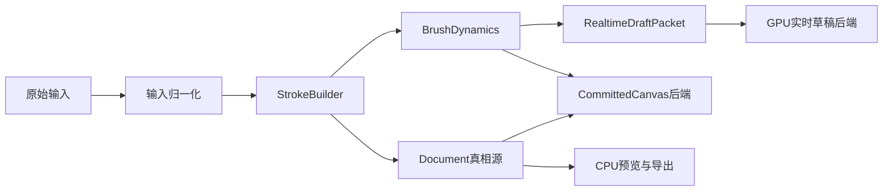

# 手绘方案二升级详细分阶段计划

## 目标

- 在现有 [MyCanvas_Ver_0/Canvas/HandDrawing/Core/HandDrawingDocument.swift](MyCanvas_Ver_0/Canvas/HandDrawing/Core/HandDrawingDocument.swift)、[MyCanvas_Ver_0/Canvas/HandDrawing/Editing/HandDrawingEditorEngine.swift](MyCanvas_Ver_0/Canvas/HandDrawing/Editing/HandDrawingEditorEngine.swift)、[MyCanvas_Ver_0/Canvas/HandDrawing/Persistence/HandDrawingDocumentStore.swift](MyCanvas_Ver_0/Canvas/HandDrawing/Persistence/HandDrawingDocumentStore.swift) 不改真相源地位的前提下，把编辑期渲染升级为 Hybrid。
- 计划中允许把 [MyCanvas_Ver_0/Canvas/HandDrawing/Rendering/HandDrawingCanvasRenderer.swift](MyCanvas_Ver_0/Canvas/HandDrawing/Rendering/HandDrawingCanvasRenderer.swift) 抽象成可替换 backend，并在后段做 GPU committed 原型，但 `preview/export/persistence` 继续以 CPU/document 为黄金路径。
- 路线要明显逼近方案三：尽早把 realtime、committed、未来 preview/export 的渲染边界抽成 renderer-agnostic，而不是继续让 brush math 与显示后端耦死在 CPU 光栅化上。

## 锁死边界

- [MyCanvas_Ver_0/Canvas/HandDrawing/Core/HandDrawingDocument.swift](MyCanvas_Ver_0/Canvas/HandDrawing/Core/HandDrawingDocument.swift)、[MyCanvas_Ver_0/Canvas/HandDrawing/Editing/HandDrawingHistoryController.swift](MyCanvas_Ver_0/Canvas/HandDrawing/Editing/HandDrawingHistoryController.swift)、[MyCanvas_Ver_0/Canvas/HandDrawing/Persistence/HandDrawingDocumentCodec.swift](MyCanvas_Ver_0/Canvas/HandDrawing/Persistence/HandDrawingDocumentCodec.swift) 继续是唯一可编码、可撤销、可迁移的真相源。
- [MyCanvas_Ver_0/Canvas/HandDrawing/Editing/HandDrawingBrushDynamics.swift](MyCanvas_Ver_0/Canvas/HandDrawing/Editing/HandDrawingBrushDynamics.swift)、[MyCanvas_Ver_0/Canvas/HandDrawing/Editing/HandDrawingStrokeBuilder.swift](MyCanvas_Ver_0/Canvas/HandDrawing/Editing/HandDrawingStrokeBuilder.swift)、[MyCanvas_Ver_0/Canvas/HandDrawing/Editing/HandDrawingInputNormalizer.swift](MyCanvas_Ver_0/Canvas/HandDrawing/Editing/HandDrawingInputNormalizer.swift)、[MyCanvas_Ver_0/Canvas/HandDrawing/Editing/HandDrawingStrokePerformanceProfile.swift](MyCanvas_Ver_0/Canvas/HandDrawing/Editing/HandDrawingStrokePerformanceProfile.swift) 必须继续做跨后端唯一 brush math。
- [MyCanvas_Ver_0/Canvas/HandDrawing/Editing/HandDrawingStrokeGeometry.swift](MyCanvas_Ver_0/Canvas/HandDrawing/Editing/HandDrawingStrokeGeometry.swift)、lasso、move、pixel eraser 的命中与几何合同不能改成位图真相；GPU 只能消费同一套 resolved stamp 语义。
- [MyCanvas_Ver_0/Canvas/HandDrawing/Rendering/HandDrawingPreviewRenderer.swift](MyCanvas_Ver_0/Canvas/HandDrawing/Rendering/HandDrawingPreviewRenderer.swift) 与 [MyCanvas_Ver_0/Canvas/HandDrawing/Persistence/HandDrawingDocumentStore.swift](MyCanvas_Ver_0/Canvas/HandDrawing/Persistence/HandDrawingDocumentStore.swift) 在整条计划内继续保留 CPU canonical preview 逻辑。

## 目标架构

## 当前锚点

- 当前 realtime/committed 双层已经存在，锚点在 [MyCanvas_Ver_0/Platform/iOS/HandDrawing/UI/HandDrawingCanvasSurfaceView.swift](MyCanvas_Ver_0/Platform/iOS/HandDrawing/UI/HandDrawingCanvasSurfaceView.swift) 与 [MyCanvas_Ver_0/Platform/iOS/HandDrawing/Presentation/HandDrawingEditorCoordinator.swift](MyCanvas_Ver_0/Platform/iOS/HandDrawing/Presentation/HandDrawingEditorCoordinator.swift)。
- 当前 committed 位图与 dirty region 路径集中在 [MyCanvas_Ver_0/Canvas/HandDrawing/Rendering/HandDrawingCanvasRenderer.swift](MyCanvas_Ver_0/Canvas/HandDrawing/Rendering/HandDrawingCanvasRenderer.swift)。
- 当前 preview/export 的 CPU 黄金路径集中在 [MyCanvas_Ver_0/Canvas/HandDrawing/Rendering/HandDrawingPreviewRenderer.swift](MyCanvas_Ver_0/Canvas/HandDrawing/Rendering/HandDrawingPreviewRenderer.swift) 与 [MyCanvas_Ver_0/Canvas/HandDrawing/Persistence/HandDrawingDocumentStore.swift](MyCanvas_Ver_0/Canvas/HandDrawing/Persistence/HandDrawingDocumentStore.swift)。
- 现有 parity 护栏已经覆盖 canvas/preview 一致性、tilt stamp、dirty region、tool 几何，可直接作为方案二前几阶段的回归基线：
  - [MyCanvas_Ver_0Tests/HandDrawingCanvasRendererTests.swift](MyCanvas_Ver_0Tests/HandDrawingCanvasRendererTests.swift)
  - [MyCanvas_Ver_0Tests/HandDrawingPreviewRendererTests.swift](MyCanvas_Ver_0Tests/HandDrawingPreviewRendererTests.swift)
  - [MyCanvas_Ver_0Tests/HandDrawingBrushDynamicsTests.swift](MyCanvas_Ver_0Tests/HandDrawingBrushDynamicsTests.swift)
  - [MyCanvas_Ver_0Tests/HandDrawingEditorEngineTests.swift](MyCanvas_Ver_0Tests/HandDrawingEditorEngineTests.swift)
  - [MyCanvas_Ver_0Tests/HandDrawingPixelEraserToolControllerTests.swift](MyCanvas_Ver_0Tests/HandDrawingPixelEraserToolControllerTests.swift)
  - [MyCanvas_Ver_0Tests/HandDrawingLassoSelectionTests.swift](MyCanvas_Ver_0Tests/HandDrawingLassoSelectionTests.swift)

## Phase 0：冻结合同并补齐方案二护栏

### 目标

- 把“哪些层是 renderer-agnostic 真相、哪些层只是显示后端”正式锁死，避免后续 GPU 接入把方案一已经收好的数学与几何合同再次打散。

### 主要动作

- 新增方案二专用测试矩阵，覆盖 4 条护栏：
  - draft packet 与 committed stroke 的样本/时间序列一致。
  - resolved stamps 作为跨后端输入时，不会破坏 [MyCanvas_Ver_0Tests/HandDrawingBrushDynamicsTests.swift](MyCanvas_Ver_0Tests/HandDrawingBrushDynamicsTests.swift) 的现有几何合同。
  - realtime draft 视觉与抬笔后的 committed canvas 在 stroke bounds 内保持可比较的一致性。
  - committed canvas backend 替换后，canvas/preview parity 仍由现有 CPU preview 测试裁决。
- 先把 `draft overlay parity` 这一类今天还缺失的测试补成计划里的第一道门禁；没有这层，不要开始 GPU 接口重构。

### 关键文件

- [MyCanvas_Ver_0Tests/HandDrawingStrokeBuilderTests.swift](MyCanvas_Ver_0Tests/HandDrawingStrokeBuilderTests.swift)
- [MyCanvas_Ver_0Tests/HandDrawingBrushDynamicsTests.swift](MyCanvas_Ver_0Tests/HandDrawingBrushDynamicsTests.swift)
- [MyCanvas_Ver_0Tests/HandDrawingCanvasRendererTests.swift](MyCanvas_Ver_0Tests/HandDrawingCanvasRendererTests.swift)
- [MyCanvas_Ver_0Tests/HandDrawingPreviewRendererTests.swift](MyCanvas_Ver_0Tests/HandDrawingPreviewRendererTests.swift)
- [MyCanvas_Ver_0Tests/HandDrawingEditorCoordinatorTests.swift](MyCanvas_Ver_0Tests/HandDrawingEditorCoordinatorTests.swift)

### 验收

- 形成一组明确的“GPU draft 与 CPU committed 必须守住什么”的回归门禁。
- 现有 canvas/preview/tool 几何回归继续全绿。

## Phase 1：前置抽象 Realtime 与 Committed 两层渲染合同

### 目标

- 在真正引入 GPU 前，先把显示后端边界抽出来，避免后面 `Metal` 直接粘在 UI 或 coordinator 上。

### 主要动作

- 新建 renderer-agnostic 契约层，至少抽出：
  - `HandDrawingRealtimeBrushRenderer`
  - `HandDrawingRealtimeDraftPacket`
  - `HandDrawingCommittedCanvasBackend`
- 约定所有 backend 都只消费共享 brush math 产物，不自行发明 pressure/tilt 公式。
- 让 [MyCanvas_Ver_0/Platform/iOS/HandDrawing/Presentation/HandDrawingEditorCoordinator.swift](MyCanvas_Ver_0/Platform/iOS/HandDrawing/Presentation/HandDrawingEditorCoordinator.swift) 从“直接持有 `draftStroke` / `committedImage` 的 UI 语义”升级为“持有可路由到不同 backend 的渲染语义”。
- 保留 [MyCanvas_Ver_0/Canvas/HandDrawing/Rendering/HandDrawingCanvasRenderer.swift](MyCanvas_Ver_0/Canvas/HandDrawing/Rendering/HandDrawingCanvasRenderer.swift) 作为第一个 `CommittedCanvasBackend` 默认实现。

### 关键文件

- [MyCanvas_Ver_0/Platform/iOS/HandDrawing/Presentation/HandDrawingEditorCoordinator.swift](MyCanvas_Ver_0/Platform/iOS/HandDrawing/Presentation/HandDrawingEditorCoordinator.swift)
- [MyCanvas_Ver_0/Platform/iOS/HandDrawing/UI/HandDrawingCanvasSurfaceView.swift](MyCanvas_Ver_0/Platform/iOS/HandDrawing/UI/HandDrawingCanvasSurfaceView.swift)
- [MyCanvas_Ver_0/Canvas/HandDrawing/Rendering/HandDrawingCanvasRenderer.swift](MyCanvas_Ver_0/Canvas/HandDrawing/Rendering/HandDrawingCanvasRenderer.swift)
- 新增 `Canvas/HandDrawing/Rendering` 层接口文件

### 验收

- 不引入 GPU 的前提下，UI、coordinator、canvas renderer 已完成“后端可替换”的边界分离。
- 现有 CPU 行为保持不变。

## Phase 2：重构 Surface，为 GPU realtime draft 让位

### 目标

- 把现有 surface 从“`UIImageView + draw(_:) overlay`”升级为“`committed host + realtime draft host`”，先把宿主结构改对。

### 主要动作

- 将 [MyCanvas_Ver_0/Platform/iOS/HandDrawing/UI/HandDrawingCanvasSurfaceView.swift](MyCanvas_Ver_0/Platform/iOS/HandDrawing/UI/HandDrawingCanvasSurfaceView.swift) 的 `draftOverlayView` 抽成独立 host，允许 CPU fallback 与未来 GPU view 热插拔。
- 让 `HandDrawingCanvasSurfaceState` 从“只描述 `CGImage + draftStroke`”升级为“描述 committed backend 输出 + realtime draft backend 输入”。
- 保持滚动、缩放、selection bounds、lasso overlay 的 UI 责任不变，避免方案二第一步就把所有 overlay 都卷进 GPU。

### 关键文件

- [MyCanvas_Ver_0/Platform/iOS/HandDrawing/UI/HandDrawingCanvasSurfaceView.swift](MyCanvas_Ver_0/Platform/iOS/HandDrawing/UI/HandDrawingCanvasSurfaceView.swift)
- [MyCanvas_Ver_0/Platform/iOS/HandDrawing/Presentation/HandDrawingEditorCoordinator.swift](MyCanvas_Ver_0/Platform/iOS/HandDrawing/Presentation/HandDrawingEditorCoordinator.swift)

### 验收

- CPU fallback backend 能通过新 host 正常显示 realtime draft。
- 不引入 GPU 的情况下，画笔、橡皮、套索、选区框表现不退化。

## Phase 3：把协调器从“整根 draftStroke”升级为“增量 realtime packet 发布器”

### 目标

- 让协调器发布增量 resolved stamps / packet，而不是每次都让显示层自己重建整根草稿。
- 这是逼近方案三的关键一步，因为它把显示输入从“文档对象”提前抽象成“可流式消费的笔刷语义”。

### 主要动作

- 在 [MyCanvas_Ver_0/Platform/iOS/HandDrawing/Presentation/HandDrawingEditorCoordinator.swift](MyCanvas_Ver_0/Platform/iOS/HandDrawing/Presentation/HandDrawingEditorCoordinator.swift) 内，把 active stroke 管理升级成：
  - 起笔固定 `HandDrawingStrokePerformanceProfile`
  - 增量归一化输入
  - 增量产出 `resolvedStamps`
  - 将 packet 分发给 realtime backend
- 继续保留抬笔后由 [MyCanvas_Ver_0/Canvas/HandDrawing/Editing/HandDrawingEditorEngine.swift](MyCanvas_Ver_0/Canvas/HandDrawing/Editing/HandDrawingEditorEngine.swift) 写入 document 的路径，防止 realtime backend 越权成为真相源。
- 把 `predictedTouches` 继续维持为实验开关，但从这个阶段开始，让 packet 契约能容纳 predicted tail。

### 关键文件

- [MyCanvas_Ver_0/Platform/iOS/HandDrawing/Presentation/HandDrawingEditorCoordinator.swift](MyCanvas_Ver_0/Platform/iOS/HandDrawing/Presentation/HandDrawingEditorCoordinator.swift)
- [MyCanvas_Ver_0/Canvas/HandDrawing/Editing/HandDrawingInputNormalizer.swift](MyCanvas_Ver_0/Canvas/HandDrawing/Editing/HandDrawingInputNormalizer.swift)
- [MyCanvas_Ver_0/Canvas/HandDrawing/Editing/HandDrawingStrokeBuilder.swift](MyCanvas_Ver_0/Canvas/HandDrawing/Editing/HandDrawingStrokeBuilder.swift)
- [MyCanvas_Ver_0/Canvas/HandDrawing/Editing/HandDrawingBrushDynamics.swift](MyCanvas_Ver_0/Canvas/HandDrawing/Editing/HandDrawingBrushDynamics.swift)
- [MyCanvas_Ver_0/Canvas/HandDrawing/Editing/HandDrawingStrokePerformanceProfile.swift](MyCanvas_Ver_0/Canvas/HandDrawing/Editing/HandDrawingStrokePerformanceProfile.swift)

### 验收

- realtime draft backend 不需要自己重建 brush math，只消费 packet 即可绘制。
- draft/commit 的样本与 brush 语义仍保持一致。

## Phase 4：接入 GPU Draft Backend，完成真正的方案二切换

### 目标

- 只把 realtime draft 切到 GPU，让 Pencil 交互手感、延迟、连续性先获益，同时不碰 document/preview/export 真相源。

### 主要动作

- 新增 iOS-only 的 GPU draft view / compositor；建议技术栈直接落在 `MetalKit` / `MTKView` 方向，而不是再造一套自定义 layer 生命周期。
- GPU 端只消费 `HandDrawingRealtimeDraftPacket` 和共享的 resolved stamp 语义。
- CPU fallback backend 继续保留，作为测试对照与运行时回退。
- 从这一阶段开始，方案二已经具备“用户可感知”的升级结果，但 committed/preview/export 仍留在 CPU 黄金路径。

### 关键文件

- 新增 `Platform/iOS/HandDrawing` 下的 GPU realtime draft 相关文件
- [MyCanvas_Ver_0/Platform/iOS/HandDrawing/UI/HandDrawingCanvasSurfaceView.swift](MyCanvas_Ver_0/Platform/iOS/HandDrawing/UI/HandDrawingCanvasSurfaceView.swift)
- [MyCanvas_Ver_0/Platform/iOS/HandDrawing/Presentation/HandDrawingEditorCoordinator.swift](MyCanvas_Ver_0/Platform/iOS/HandDrawing/Presentation/HandDrawingEditorCoordinator.swift)

### 验收

- GPU draft 开启后，现有文档提交、undo/redo、preview 生成、持久化结果保持不变。
- CPU fallback 与 GPU draft 在关键场景下能通过 parity 测试对照。

## Phase 5：前移 Committed Canvas Backend 抽象，并做 GPU committed 原型

### 目标

- 在不动 `document/history/persistence/preview` 真相的前提下，把 [MyCanvas_Ver_0/Canvas/HandDrawing/Rendering/HandDrawingCanvasRenderer.swift](MyCanvas_Ver_0/Canvas/HandDrawing/Rendering/HandDrawingCanvasRenderer.swift) 从“固定 CPU renderer”升级为“默认 CPU、可选 GPU committed backend”。
- 这是逼近方案三的第一条实质性台阶。

### 主要动作

- 让 committed canvas 的 dirty region、clip、partial rerender 语义变成 backend 契约，而不是 `CGContext` 细节。
- 继续让 [MyCanvas_Ver_0/Canvas/HandDrawing/Editing/HandDrawingEditorEngine.swift](MyCanvas_Ver_0/Canvas/HandDrawing/Editing/HandDrawingEditorEngine.swift) 只产出 document 变化与 dirty region，不感知 CPU/GPU。
- 做一个 GPU committed 原型，但范围只限编辑期 committed canvas，不扩散到 preview/export。
- 保持 [MyCanvas_Ver_0/Canvas/HandDrawing/Rendering/HandDrawingPreviewRenderer.swift](MyCanvas_Ver_0/Canvas/HandDrawing/Rendering/HandDrawingPreviewRenderer.swift) 继续做 CPU golden renderer，用它裁决 committed backend 的正确性。

### 关键文件

- [MyCanvas_Ver_0/Canvas/HandDrawing/Rendering/HandDrawingCanvasRenderer.swift](MyCanvas_Ver_0/Canvas/HandDrawing/Rendering/HandDrawingCanvasRenderer.swift)
- [MyCanvas_Ver_0/Canvas/HandDrawing/Rendering/HandDrawingPreviewRenderer.swift](MyCanvas_Ver_0/Canvas/HandDrawing/Rendering/HandDrawingPreviewRenderer.swift)
- [MyCanvas_Ver_0/Canvas/HandDrawing/Rendering/HandDrawingDirtyRegionTracker.swift](MyCanvas_Ver_0/Canvas/HandDrawing/Rendering/HandDrawingDirtyRegionTracker.swift)
- [MyCanvas_Ver_0/Canvas/HandDrawing/Editing/HandDrawingEditorEngine.swift](MyCanvas_Ver_0/Canvas/HandDrawing/Editing/HandDrawingEditorEngine.swift)

### 验收

- CPU committed backend 仍是默认实现。
- GPU committed 原型在局部重绘、erase、layer order、tilt stamp 上能通过 parity 基线。
- 即使 GPU committed 关闭，系统行为也没有回归。

## Phase 6：统一 Render Graph 边界，刻意逼近方案三但不越线

### 目标

- 把 realtime、committed、未来 preview/export 所需的渲染输入语义统一成 renderer-agnostic graph，使后续若继续推进方案三，不需要再从 brush math、tool geometry、dirty region 上反向拆一遍。
- 但本阶段仍不把 preview/export/persistence 从 CPU 真相源上挪走。

### 主要动作

- 把 `resolved stamp / erase mask / layer order / dirty region / paper transform` 这些渲染输入整理成统一 graph 或 packet 层。
- 让 [MyCanvas_Ver_0/Canvas/HandDrawing/Rendering/HandDrawingStrokeRasterizer.swift](MyCanvas_Ver_0/Canvas/HandDrawing/Rendering/HandDrawingStrokeRasterizer.swift) 从“默认唯一渲染器”退化为“CPU backend 实现之一”。
- 保持 [MyCanvas_Ver_0/Canvas/HandDrawing/Editing/HandDrawingStrokeGeometry.swift](MyCanvas_Ver_0/Canvas/HandDrawing/Editing/HandDrawingStrokeGeometry.swift)、lasso、pixel eraser、move selection 继续围绕同一套 graph 输入工作，避免 renderer graph 和 tool graph 两套合同并存。
- 只为未来方案三留出 preview/export GPU 化的接口，不在本阶段把 canonical preview 切走。

### 关键文件

- [MyCanvas_Ver_0/Canvas/HandDrawing/Rendering/HandDrawingStrokeRasterizer.swift](MyCanvas_Ver_0/Canvas/HandDrawing/Rendering/HandDrawingStrokeRasterizer.swift)
- [MyCanvas_Ver_0/Canvas/HandDrawing/Editing/HandDrawingStrokeGeometry.swift](MyCanvas_Ver_0/Canvas/HandDrawing/Editing/HandDrawingStrokeGeometry.swift)
- [MyCanvas_Ver_0/Canvas/HandDrawing/Rendering/HandDrawingPreviewRenderer.swift](MyCanvas_Ver_0/Canvas/HandDrawing/Rendering/HandDrawingPreviewRenderer.swift)
- [MyCanvas_Ver_0/Canvas/HandDrawing/Persistence/HandDrawingDocumentStore.swift](MyCanvas_Ver_0/Canvas/HandDrawing/Persistence/HandDrawingDocumentStore.swift)

### 验收

- realtime、committed、tool geometry 已共享一套 renderer-agnostic 输入语义。
- preview/export 仍由 CPU golden path 输出，但未来替换点已经变得清晰、局部、可测试。

## Phase 7：方案二收口与“是否继续进入方案三”的决策点

### 目标

- 让方案二形成稳定可发布形态，并明确下一步是否真的要跨入方案三。

### 主要动作

- 回归审查三条最终边界：
  - `document/history/persistence` 是否仍是唯一真相源。
  - canvas/preview parity 是否仍由 CPU preview 裁决。
  - lasso/eraser/move 是否仍以向量语义而非位图真相工作。
- 基于真实数据评估是否继续进入方案三：
  - 如果 GPU draft + GPU committed 已经满足交互和大画布需求，就停在方案二。
  - 如果 committed、preview/export、tool graph 已经开始成为明显瓶颈，再单开方案三计划，而不是把方案二拖成失控的半重写工程。

### 验收

- 方案二形成清晰的“可发布边界”。
- 是否跨入方案三有明确技术判据，而不是凭感觉继续加码。

## 不纳入这份计划的内容

- 不在本计划内把 [MyCanvas_Ver_0/Canvas/HandDrawing/Persistence/HandDrawingDocumentCodec.swift](MyCanvas_Ver_0/Canvas/HandDrawing/Persistence/HandDrawingDocumentCodec.swift) 改成 GPU/位图真相。
- 不在本计划内把 pixel eraser 改成纯位图擦除。
- 不在本计划内把 canonical preview 的真相从 CPU/document 切换到 GPU framebuffer。
- 不在本计划内让 undo/redo 以位图块为单位工作。

## 完成标志

- 方案二完成时，用户可见层面已经获得 GPU realtime draft 与可替换 committed backend。
- 代码层面已经把 realtime、committed、未来 preview/export 的 renderer 边界前移抽象好。
- 但系统级真相源仍稳稳落在 document/history/persistence 上，这样既完成方案二，也把真正进入方案三前最难拆的边界提前拆干净。